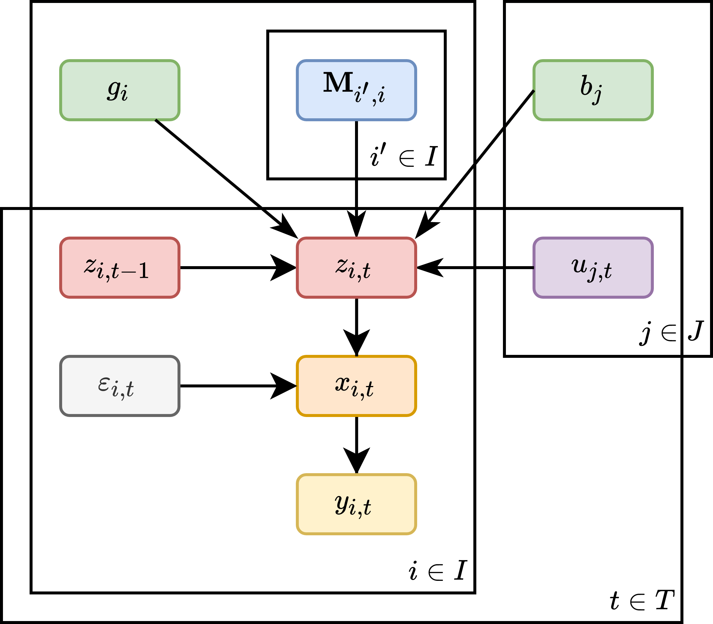
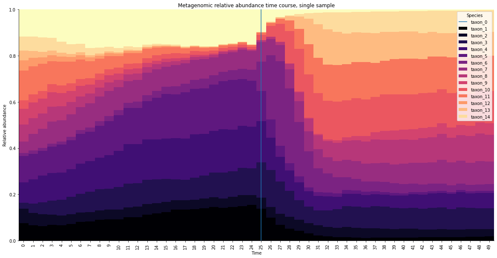
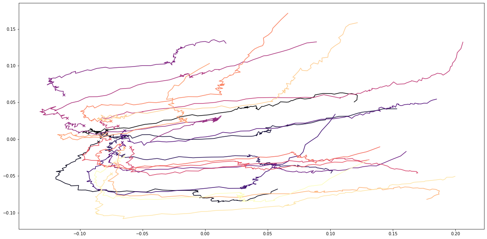
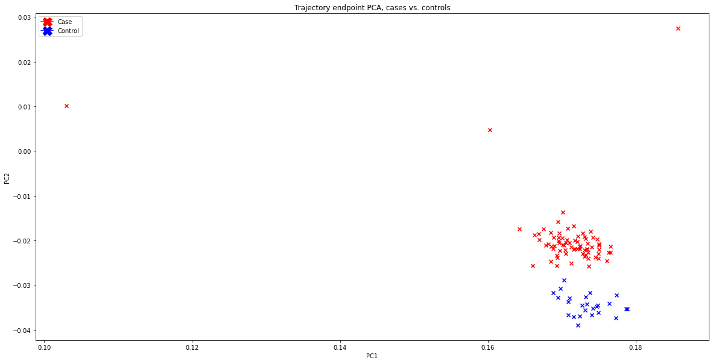
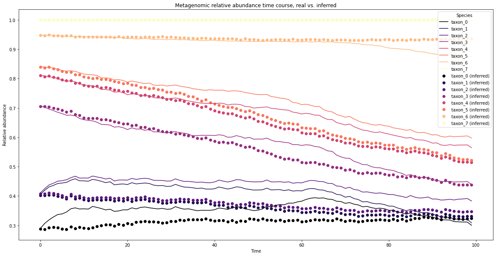

# MiSDEED
Microbiome Synthetic Data Engine for Experimental Design

<!-- example synthetic data goes here -->

# Anonymous feedback form
User feedback is important to us. While you are welcome to create an issue in Github, please be aware that we are also monitoring anonymous feedback via [this form](https://forms.gle/BpymPre851csE9JL7).

# Misdeed command-line interface

## Usage
MiSDEED is used as follows:
```bash
    ./misdeed [-h] node_sizes [-iNtDCPVRnevrTdciE] [--options]
```
Here the `node_sizes` positional parameter is a comma-separated list of integers. To see MiSDEED parameters, run the following command:
```bash
./misdeed -h
```

## Dependencies
Dependencies are listed in `requirements.txt` and can be installed using
```bash
pip install -r requirements.txt
```

## Example
```bash
git clone https://github.com/pchlenski/misdeed
cd misdeed

# install requirements
pip install -r requirements.txt

# generate a trajectory from the `example' directory to the `out' directory
./misdeed 4 --input_dir ./example --output_dir ./out

# modify generator parameters
./misdeed 10,15,20 --node_names mgx,mbx,mtx --time_points 50 --discard_first 50

# custom community matrix
./misdeed 10,15,20 --connectivity 0.4 --self_penalty 10 --variance 1.5 --correlation 0.5

# custom simulation parameters
./misdeed 10,15,20 --n_samples 10 --extinct_fraction 0.1 --noise_variance 0.001 --n_reads 2000 --time_step 0.05 --downsample 5

# custom case-control parameters
./misdeed 10,15,20 --n_samples 10 --case_fraction 0.5 --intervention_node n0 --effect_size 0.5

# generate and plot case-control trajectories
./misdeed 10,15,20 --n_samples 10 --case_fraction 0.5 --plot --pca
```

## Inputs
If using the ```--input_dir``` parameter, MiSDEED will assume your input directory follows these conventions:
* All files are in tsv (tab-separated values) format and end in ".tsv"
* Node conventions:
    * Initial abundances are named ```[node_name]_x0.tsv```
    * Growth rates are named ```[node_name]_g.tsv```
    * Each node has a growth rate and a node name
    * Initial abundances and growth rates are equal to node dimensionality
* Intervention conventions:
    * Intervention magnitudes are named ```[intervention_name]_[node_name]_u.tsv```
    * Node responses are named ```[intervention_name]_[node_name]_b.tsv```
    * Each intervention has a growth rate and a node name
    * Intervention magnitude dimensionality is equal to number of time points (set by ```--time_points``` parameter)
    * Node response dimensionality is equal to node dimensionality
* Interaction conventions:
    * Interactions are named ```[outbound_node_name]->[inbound_node_name].tsv```
    * At least one interaction is defined
    * Interaction matrix has shape (outbound node dimensionality) x (inbound node dimensionality)

The `example` directory in this repository contains a minimal example of these conventions.

## Outputs
By default, MiSDEED will save results to the `./output` directory as follows:

### Single sample
```
output
`---[UUID]
    |---X
    |   |---[node_0_name].tsv
    |   |---[node_1_name].tsv
    |   `---...
    |---Y
    |   |---[node_0_name].tsv
    |   |---[node_1_name].tsv
    |   `---...
    |---Z
    |   |---[node_0_name].tsv
    |   |---[node_1_name].tsv
    |   `---...
    |---pca
    |   |---[node_0_name].png
    |   |---[node_1_name].png
    |   `---...
    `---plots
        |---[node_0_name].png
        |---[node_1_name].png
        `---...
```

### Multiple samples
```
output
`---[UUID]
    |---X
    |   |---0
    |   |   |---[node_0_name].tsv
    |   |   |---[node_1_name].tsv
    |   |   `---...
    |   |---1
    |   |   |---[node_0_name].tsv
    |   |   |---[node_1_name].tsv
    |   |   `---...
    |   `---...
    |---Y
    |   |---0
    |   |   |---[node_0_name].tsv
    |   |   |---[node_1_name].tsv
    |   |   `---...
    |   |---1
    |   |   |---[node_0_name].tsv
    |   |   |---[node_1_name].tsv
    |   |   `---...
    |   `---...
    |---Z
    |   |---0
    |   |   |---[node_0_name].tsv
    |   |   |---[node_1_name].tsv
    |   |   `---...
    |   |---1
    |   |   |---[node_0_name].tsv
    |   |   |---[node_1_name].tsv
    |   |   `---...
    |   `---...
    |---pca
    |   |---[node_0_name].png
    |   |---[node_1_name].png
    |   `---...
    `---plots
        |---0_[node_0_name].png
        |---0_[node_1_name].png
        |---...
        |---1_[node_0_name].png
        |---1_[node_1_name].png
        `---...
```

### Case-control
```
output
`---[UUID]
    |---case
    |   |---X
    |   |   |---0
    |   |   |   |---[node_0_name].tsv
    |   |   |   |---[node_1_name].tsv
    |   |   |   `---...
    |   |   |---1
    |   |   |   |---[node_0_name].tsv
    |   |   |   |---[node_1_name].tsv
    |   |   |   `---...
    |   |   `---...
    |   |---Y
    |   |   |---0
    |   |   |   |---[node_0_name].tsv
    |   |   |   |---[node_1_name].tsv
    |   |   |   `---...
    |   |   |---1
    |   |   |   |---[node_0_name].tsv
    |   |   |   |---[node_1_name].tsv
    |   |   |   `---...
    |   |   `---...
    |   |---Z
    |   |   |---0
    |   |   |   |---[node_0_name].tsv
    |   |   |   |---[node_1_name].tsv
    |   |   |   `---...
    |   |   |---1
    |   |   |   |---[node_0_name].tsv
    |   |   |   |---[node_1_name].tsv
    |   |   |   `---...
    |   |   `---...
    |   `---plots
    |       |---0_[node_0_name].png
    |       |---0_[node_1_name].png
    |       |---...
    |       |---1_[node_0_name].png
    |       |---1_[node_1_name].png
    |       `---...
    |---control
    |   |---X
    |   |   |---0
    |   |   |   |---[node_0_name].tsv
    |   |   |   |---[node_1_name].tsv
    |   |   |   `---...
    |   |   |---1
    |   |   |   |---[node_0_name].tsv
    |   |   |   |---[node_1_name].tsv
    |   |   |   `---...
    |   |   `---...
    |   |---Y
    |   |   |---0
    |   |   |   |---[node_0_name].tsv
    |   |   |   |---[node_1_name].tsv
    |   |   |   `---...
    |   |   |---1
    |   |   |   |---[node_0_name].tsv
    |   |   |   |---[node_1_name].tsv
    |   |   |   `---...
    |   |   `---...
    |   |---Z
    |   |   |---0
    |   |   |   |---[node_0_name].tsv
    |   |   |   |---[node_1_name].tsv
    |   |   |   `---...
    |   |   |---1
    |   |   |   |---[node_0_name].tsv
    |   |   |   |---[node_1_name].tsv
    |   |   |   `---...
    |   |   `---...
    |   `---plots
    |       |---0_[node_0_name].png
    |       |---0_[node_1_name].png
    |       |---...
    |       |---1_[node_0_name].png
    |       |---1_[node_1_name].png
    |       `---...
    `---pca
        |---[node_0_name].png
        |---[node_1_name].png
        `---...

```


# OmicsGenerator Python package

The `OmicsGenerator` class has the following public methods:
* `add_node`: Adds nodes to generator object.
* `add_interaction`: Adds interactions to generator object.
* `add_intervention`:  Adds an intervention to generator.
* `set_initial_value`: Sets a node value or growth rate.
* `get`: Gets a (node/interaction/intervention) by name.
* `remove`: Removes a node, intervention, or interaction from the generator by name.
* `generate`: Generates a single timecourse of synthetic data.
* `generate_multiple`: Generates several timecourses of synthetic data.
* `case_control`: Generates synthetic case and control timecourses.
* `copy`: Makes a deep copy of generator.
* `save`: Saves generator outputs as plaintext files.

In addition, the package contains a number of utility functions:
* `inference.infer_glv_params`: Infers community matrix, growth rates, and perturbation responses from absolute abundance data.
* `visualization.plot_timecourse`: Plots timecourses of compositional data.
* `visualization.plot_pca`: Plots PCA-transformed timecourses.

## Examples
The corresponding Jupyter notebook can be found at `notebooks/examples.ipynb`.

### Initialize generator
```python
# initialize generator:
gen = OmicsGenerator(
    nodes=['mgx', 'mbx'],  # 2 nodes named 'mgx' and 'mbx'
    node_sizes=[15, 15],   # each node has 15 dimensions
    init_full=True         # set interaction matrices and growth rates randomly
)

# add intervention:
gen.add_intervention(
    'int1',                # intervention name
    'mgx',                 # apply to 'mgx' node
    10*np.random.rand(15), # set intervention response vector randomly
    start=50,              # start at t=50
    end=100                # go to end
)

```

### Single timecourse
```python
# run generator and plot:
z1, x1, y1 = gen.generate(dt=1e-2)
plot_timecourse(y1['mgx'])
plt.vlines(50, 0, 1)
```


### Multiple timecourses
```python
# run multi-generator and plot:
z2, x2, y2 = gen.generate_multiple(20)
plot_pca([y2], 'mgx')
```


### Case-control
```python
# run case-control and plot:
z3_control, x3_control, y3_control, z3_case, x3_case, y3_case = gen.case_control(100, .75, 'mgx', 1)
plot_pca([y3_control, y3_case], 'mgx', colors=['red', 'blue'], plot_trajectories=False)
```


### Using learned parameters
```python
# run case-control and plot:
gen4 = OmicsGenerator(
    nodes=['mgx'],         # 1 node named 'mgx'
    node_sizes=[15],       # 'mgx' has 15 dimensions
    init_full=True         # set interaction matrices and growth rates randomly
)

# add intervention:
gen4.add_intervention(
    'int1',                # intervention name
    'mgx',                 # apply to 'mgx' node
    10*np.random.rand(15), # set intervention response vector randomly
    start=50,              # start at t=50
    end=100                # go to end
)

# generate training data
z4, x4, y4 = gen4.generate(dt=1e-2)

# infer params
M, u, E = infer_glv_params(
    z4['mgx'],             # use (latent) absolute abundances
    gen4.get('int1').U,    # assume intervention indicator is known
    interaction_reg=100,   # L1 penalty for interaction matrix
    growth_reg=0,          # L1 penalty for growth rates
    intervention_reg=0,    # L1 penalty for intervention responses
    dt=1e-2                # same time-step as generator
)

# build inferred generator
gen4_inferred = OmicsGenerator(nodes=['mgx'], node_sizes=[15])
gen4_inferred.add_interaction('M', 'mgx', 'mgx', M)
gen4_inferred.add_intervention('int1', 'mgx', E.reshape(-1), start=50, end=100)
gen4_inferred.set_initial_value('mgx', u.reshape(-1), growth_rate=True)
gen4_inferred.set_initial_value('mgx', gen4.get('mgx').initial_value) # same init. abundances as gen 1

z4_inferred, x4_inferred, y4_inferred = gen4_inferred.generate(dt=1e-2)

# plot both trajectories
colors = cm.get_cmap('magma', 20)(range(15))

for i in range(15):
    plt.plot(np.cumsum(z4_inferred['mgx'], axis=1)[:,i], alpha=0.5, c=colors[i])
    plt.plot(np.cumsum(z4['mgx'], axis=1)[:,i], alpha=0.5, c=colors[i])
```



# MiSDEED paper and citation

The preprint for MiSDEED is available [on bioRxiv](https://doi.org/10.1101/2021.08.09.455682). It can be cited as follows:

```
@article {chlenski2021misdeed,
    author = {Chlenski, Philippe and Hsu, Melody and Pe'er, Itsik},
    title = {MiSDEED: a synthetic multi-omics engine for microbiome power analysis and study design},
    year = {2021},
    doi = {10.1101/2021.08.09.455682},
    publisher = {Cold Spring Harbor Laboratory},
    journal = {bioRxiv}
}
```