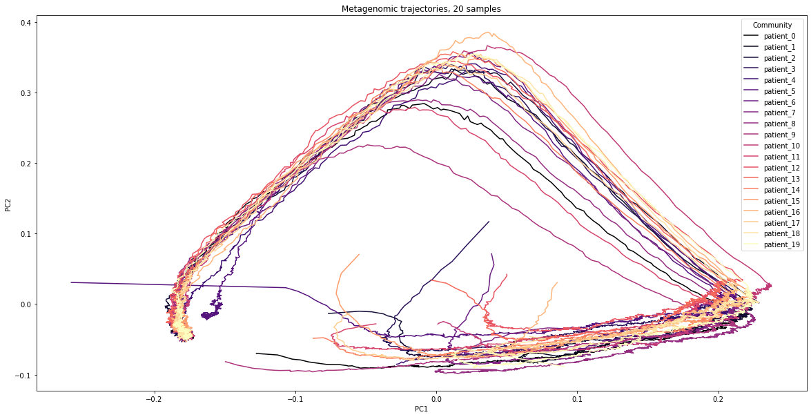

# ubiome-sim
Microbiome data simulator for power analysis

<!-- generator schematic goes here -->
<!-- example synthetic data goes here -->

The OmicsGenerator class has the following methods:
* `add_node`: Adds nodes to generator object.
* `add_interaction`: Adds interactions to generator object.
* `add_intervention`:  Adds an intervention to generator.
* `set_initial_value`: Sets a node value or growth rate.
* `get`: Gets a (node/interaction/intervention) by name.
* `remove`: Removes a node, intervention, or interaction from the generator by name.
* `generate`: Generates a single timecourse of synthetic data.
* `generate_multiple`: Generates several timecourses of synthetic data.
* `case_control`: Generates synthetic case and control timecourses.
* `copy`: Makes a deep copy of generator.

## Dependencies
Dependencies are listed in `requirements.txt` and can be installed using
```bash
pip install -r requirements.txt
```

## Examples
The corresponding jupyter notebook can be found at `notebooks/examples.ipynb`.

### Initialize generator
```python
# initialize generator:
gen = OmicsGenerator(
    100,                   # 100 time points
    ['mgx', 'mbx'],        # 2 nodes named 'mgx' and 'mbx'
    [15, 15],              # each node has 15 dimensions
    init_full=True         # set interaction matrices and growth rates randomly
)

# add intervention:
gen.add_intervention(
    'int1',                # intervention name
    'mgx',                 # apply to 'mgx' node
    10*np.random.rand(15), # set intervention response vector randomly
    start=50,              # start at t=50
    end=100                # go to end
)

```
```
Node 'mgx' initialized
Node 'mbx' initialized
Interaction 'mgx->mgx' added
set m:(mgx)->(mgx):   0:15    0:15
Interaction 'mgx->mbx' added
set m:(mgx)->(mbx):   0:15    15:30
Interaction 'mbx->mgx' added
set m:(mbx)->(mgx):   15:30    0:15
Interaction 'mbx->mbx' added
set m:(mbx)->(mbx):   15:30    15:30
Added growth rates to node mgx
Added growth rates to node mgx
Added growth rates to node mbx
Added growth rates to node mbx
Initialized
```

### Single timecourse
```python
# run generator and plot:
x1, y1, z1 = gen.generate(dt=1e-2)
plot_timecourse(y1['mgx'])
plt.vlines(50, 0, 1)
```


### Multiple timecourses
```python
# run multi-generator and plot:
x2, y2, z2 = gen.generate_multiple(20)
plot_pca([y2], 'mgx')
```


### Case-control
```python
# run case-control and plot:
x3_control, y3_control, z3_control, x3_case, y3_case, z3_case = gen.case_control(100, .75, 'mgx', 1)
plot_pca([y3_control, y3_case], 'mgx', colors=['red', 'blue'], plot_trajectories=False)
```


### Using learned interaction matrices
```python
# run case-control and plot:
M, u, E = infer_glv_params(z1['mgx'], gen.get('int1'), dt=1e-2)
gen2 = OmicsGenerator(100, ['mgx'], [15])
gen2.add_interaction('M', 'mgx', 'mgx', M)
gen2.add_intervention('int1', 'mgx', E)
gen2.set_initial_value('mgx', u, growth_rate=True)
gen2.set_initial_value('mgx', gen.get('mgx').initial_value) # same init. abundances as gen 1

x4, y4, z4 = gen2.generate(dt=1e-2)
plot_timecourse(y4['mgx'])
plt.vlines(50, 0, 1)
```


## Citation
TODO